<h1 style="font-size: 35px;">Elicitação de Requisitos</h1>

# Benchmarking

## Objetivo

O benchmark tem como objetivo analisar aplicações consolidadas nas áreas de saúde, monitoramento de hábitos e gamificação, identificando funcionalidades, estratégias de retenção de usuários e soluções de interface que possam contribuir para o desenvolvimento do projeto Cinco Tigres Felizes.

A análise busca avaliar:

- Funcionalidades oferecidas;
- Estratégias de engajamento do usuário;
- Uso de gamificação;
- Facilidade de uso;
- Diferenciais competitivos;
- Integração entre funcionalidades de saúde e hábitos;
- Potencial de retenção do usuário.

Os projetos escolhidos para comparação representam diferentes abordagens dentro do segmento de saúde e hábitos:

- Projeto Cinco Tigres Felizes;
- Meu SUS Digital;
- Habitica;
- WaterMinder;
- Google Fit;
- Samsung Health.

## Análise Comparativa

  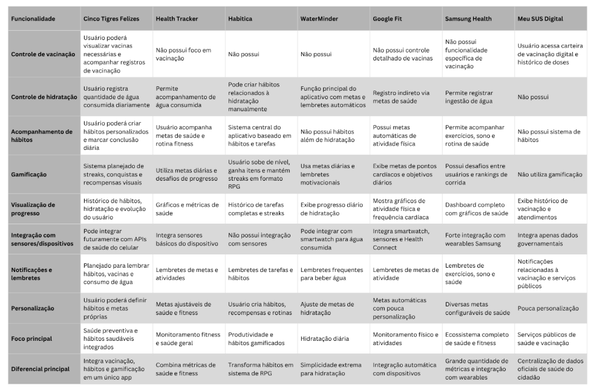

### Cinco Tigres Felizes

O diferencial do projeto está na integração entre saúde preventiva e hábitos cotidianos dentro de uma única aplicação. Enquanto muitos aplicativos focam exclusivamente em fitness ou produtividade, o projeto busca centralizar informações importantes de saúde e incentivar hábitos saudáveis por meio de gamificação.

**Aspectos Relevantes**

- Controle de vacinação;
- Monitoramento de ingestão de água;
- Cadastro e acompanhamento de hábitos;
- Sistema de conquistas;
- Sistema de streaks;
- Visualização de progresso;
- Desenvolvimento multiplataforma utilizando Flutter.

Outro ponto relevante é o uso do Flutter, permitindo desenvolvimento multiplataforma para web e mobile com uma base de código unificada.
A proposta de incluir streaks, conquistas e acompanhamento visual de progresso pode aumentar significativamente o engajamento dos usuários, especialmente se combinada com uma interface simples e rápida de utilizar.

### Análise para o Projeto

Por ainda estar em desenvolvimento, algumas funcionalidades presentes em aplicativos consolidados ainda não foram implementadas. Entretanto, o projeto possui potencial para se diferenciar ao unir funcionalidades que normalmente estão separadas em diferentes aplicativos.

---

### Meu SUS Digital

O Meu SUS Digital é atualmente a principal referência nacional quando o assunto é acesso a informações oficiais de saúde. O aplicativo permite consultar histórico de vacinação, exames, medicamentos, atendimentos médicos e diversos documentos relacionados ao SUS. Também oferece carteira de vacinação digital e acompanhamento de informações clínicas do cidadão.

  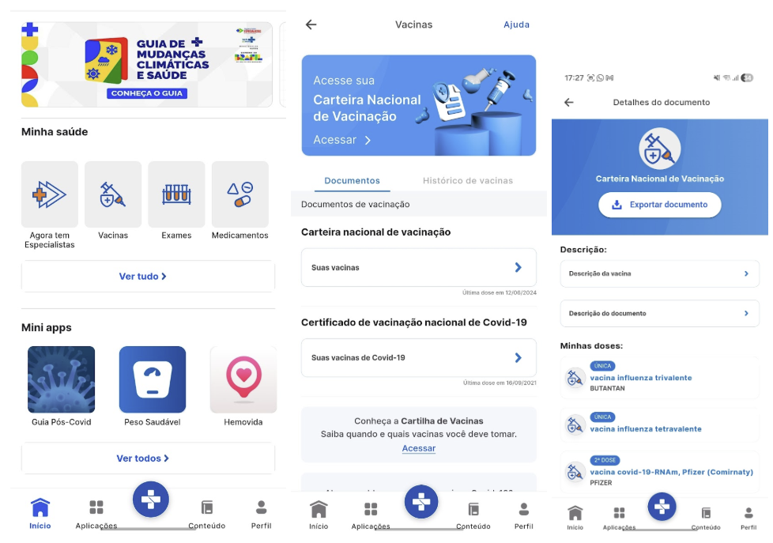

**Aspectos Relevantes**

- Carteira de vacinação digital;
- Histórico de vacinação;
- Consulta de exames;
- Consulta de medicamentos;
- Integração com a Rede Nacional de Dados em Saúde (RNDS);
- Confiabilidade das informações.

O principal ponto forte do aplicativo é a confiabilidade dos dados, uma vez que as informações são integradas à Rede Nacional de Dados em Saúde (RNDS).

**Análise para o Projeto**
O aplicativo possui poucas estratégias de retenção. O usuário normalmente o utiliza para consultar informações específicas, sem mecanismos que incentivem o uso diário, como metas, hábitos, conquistas ou streaks. Essa é uma oportunidade de diferenciação para o projeto Cinco Tigres Felizes, que busca incentivar o uso contínuo através de gamificação e acompanhamento de hábitos.

---

### Habitica

O Habitica é um dos principais benchmarks relacionados à gamificação. Seu sistema transforma hábitos e tarefas em mecânicas de RPG, utilizando níveis, recompensas, experiência e progressão visual.

  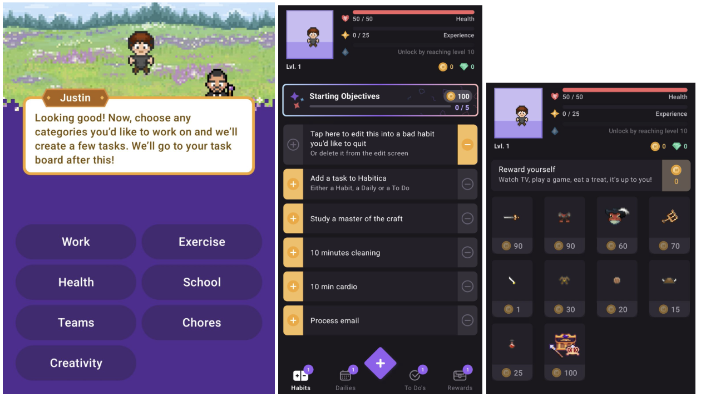

**Aspectos Relevantes**

- Sistema de níveis;
- Experiência (XP);
- Avatar personalizável;
- Moedas virtuais;
- Loja de itens;
- Conquistas;
- Progressão visual.

O aplicativo demonstra como elementos de jogo podem aumentar a retenção dos usuários e incentivar constância nos hábitos. Você cria um avatar e sempre que conclui um objetivo traçado, ganha moedas. Com as moedas, você pode comprar itens e roupas para seu avatar.

**Análise para o Projeto:**
O Habitica é uma importante referência para a implementação de mecânicas de gamificação no Cinco Tigres Felizes. Apesar disso, o aplicativo não possui foco em saúde preventiva nem integração com informações médicas, funcionando mais como um gerenciador gamificado de produtividade.

---

### WaterMinder

O WaterMinder é um benchmark importante pela simplicidade de uso. O aplicativo resolve uma única tarefa: registrar consumo de água rapidamente.

  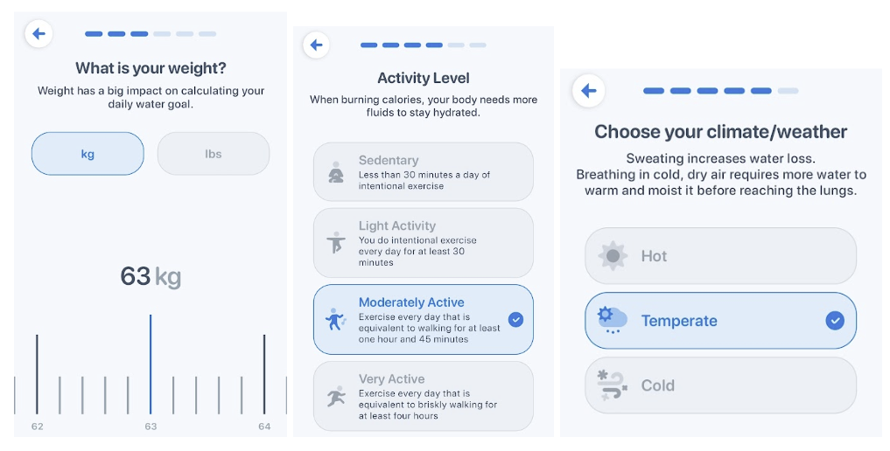

**Aspectos Relevantes**

- Registro rápido de água;
- Meta diária personalizada;
- Lembretes;
- Histórico de hidratação;
- Estatísticas;
- Sistema de conquistas.

Seu principal diferencial é a baixa fricção na interação, permitindo registros rápidos e lembretes constantes. O aplicativo também calcula automaticamente qual seria a quantidade de água diária ideal para o usuário de acordo com informações fisiológicas.
Durante o dia o usuário adiciona a quantidade de água consumida e acompanha seu progresso.

  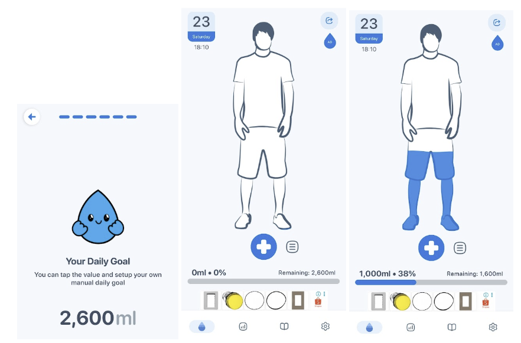

Também é possível visualizar histórico e conquistas, apesar de algumas features serem bloqueadas pela versão premium.

  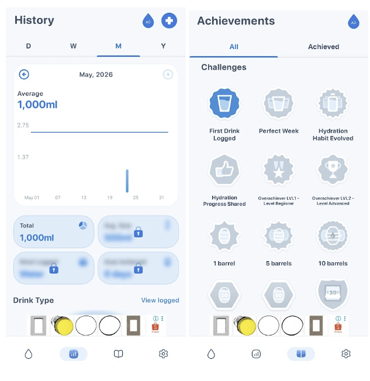

**Análise para o Projeto:**
O WaterMinder demonstra que ações realizadas várias vezes ao dia precisam exigir o mínimo possível de interações. Essa simplicidade deve servir como referência para o módulo de hidratação do Cinco Tigres Felizes. Entretanto, o aplicativo possui escopo limitado e pouca variedade de funcionalidades além da hidratação.

---

### Google Fit

O Google Fit é uma referência em integração de dados de saúde, utilizando sensores do dispositivo e integração com wearables.

  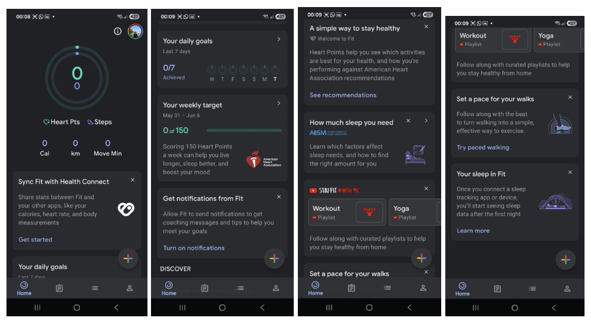

**Aspectos Relevantes**

- Integração com sensores;
- Integração com wearables;
- Registro automático de atividades;
- Estatísticas e métricas de saúde;
- Histórico de atividades;
- Journal para formação de hábitos.

O aplicativo automatiza parte da coleta de dados, reduzindo o esforço do usuário. Uma funcionalidade interessante é a área de Journal, que auxilia na formação de novos hábitos:

  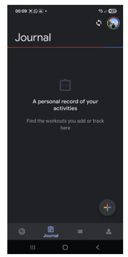

**Análise para o Projeto:**
Apesar de apresentar pouca gamificação, o Google Fit demonstra a importância da visualização de métricas e da redução do esforço de entrada de dados. O foco do aplicativo está principalmente na métrica de passos, deixando outras funcionalidades como hidratação em áreas secundárias da interface.

---

### Samsung Health

O Samsung Health oferece um ecossistema bastante completo, reunindo exercícios, sono, alimentação e monitoramento corporal.

  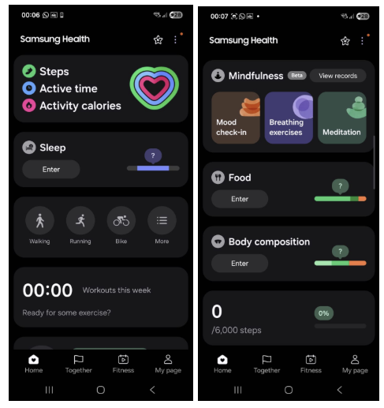

**Aspectos Relevantes**

- Exercícios físicos;
- Sono;
- Alimentação;
- Monitoramento corporal;
- Integração com dispositivos;
- Funcionalidade Together.

Seu ponto forte está na quantidade de funcionalidades e integração com dispositivos móveis. Um diferencial é a aba Together, que funciona como uma espécie de rede social em que o usuário consegue interagir com outros usuários e fortalecer hábitos saudáveis.

**Análise para o Projeto:**
O aplicativo demonstra o potencial de recursos sociais para aumentar o engajamento e a motivação dos usuários. Por outro lado, a interface pode se tornar mais complexa devido ao excesso de informações, reduzindo a simplicidade da experiência para alguns usuários. Além disso, o foco principal continua sendo atividades físicas, sem grande destaque para vacinação ou hidratação.

---

## Pontos importantes para avaliação no Projeto

Com base no benchmark realizado, os principais aspectos que devem ser observados durante o desenvolvimento do Cinco Tigres Felizes são:

- **Simplicidade da Experiência:** Registrar água, hábitos ou vacinas deve exigir poucos passos. Aplicativos com interações rápidas tendem a ter maior retenção.
- **Estratégias de Engajamento:** Elementos como streaks, conquistas, metas e progresso visual são importantes para incentivar o uso contínuo.
- **Integração de Funcionalidades:** O principal diferencial do projeto pode ser justamente unir diferentes áreas da saúde em um único aplicativo sem tornar a interface complexa.
- **Visualização de Progresso:** Gráficos, estatísticas e histórico visual ajudam o usuário a perceber evolução ao longo do tempo.
- **Escalabilidade:** A arquitetura do projeto deve permitir inclusão futura de novas funcionalidades sem dificultar a manutenção do código.
- **Segurança e Privacidade:** Mesmo sendo um projeto acadêmico, é importante considerar armazenamento seguro e proteção de dados relacionados à saúde.

## Conclusão

O benchmark demonstra que o projeto possui potencial para se diferenciar ao integrar saúde preventiva, hábitos e gamificação em uma única plataforma. Enquanto aplicativos como Habitica possuem forte engajamento, eles não são voltados para saúde. Já aplicações como Google Fit e Samsung Health possuem monitoramento avançado, mas menor personalização de hábitos e gamificação. Dessa forma, o principal desafio do projeto será equilibrar variedade de funcionalidades com simplicidade de uso, garantindo que o aplicativo permaneça intuitivo, útil e motivador para os usuários.

---

# Brainstorming

Antes da consolidação dos requisitos, a equipe listou funcionalidades focadas nos diferenciais identificados no _benchmarking_.

  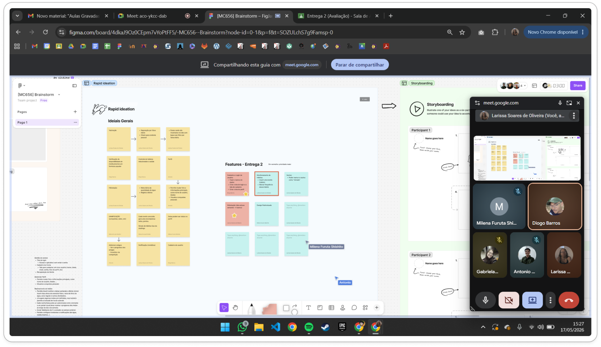

Ideias gerais:

  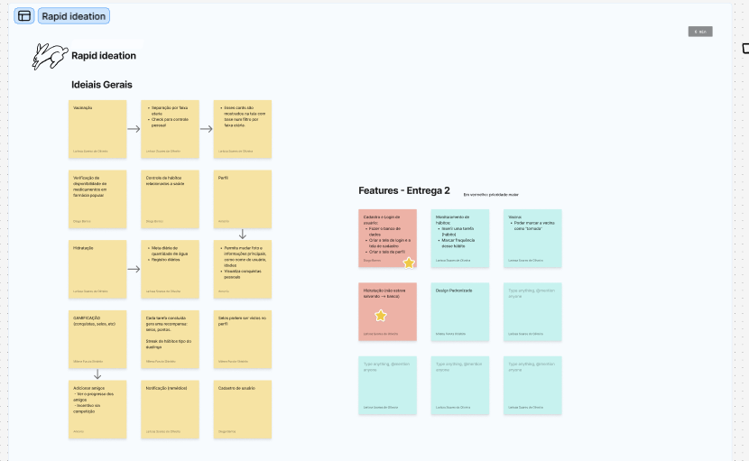

Entre as ideias priorizadas, destacam-se:

- Carteira de vacinação digital com alertas para vacinas futuras.
- Registro rápido de consumo de água, atrelado a metas diárias e lembretes.
- Cadastro de hábitos saudáveis integrados a um sistema de _streaks_, conquistas e estatísticas de progresso com gráficos de evolução.

Após análise de viabilidade técnica, decidiu-se que o maior valor do produto está em **equilibrar a variedade dessas funcionalidades com a simplicidade de uso**, usando o Flutter para suportar a arquitetura multiplataforma.

---

# Storyboarding

Abaixo estão os cenários visuais e de interação ilustrados na jornada do usuário (Bernardo) com o uso do aplicativo Cinco Tigres Felizes:

  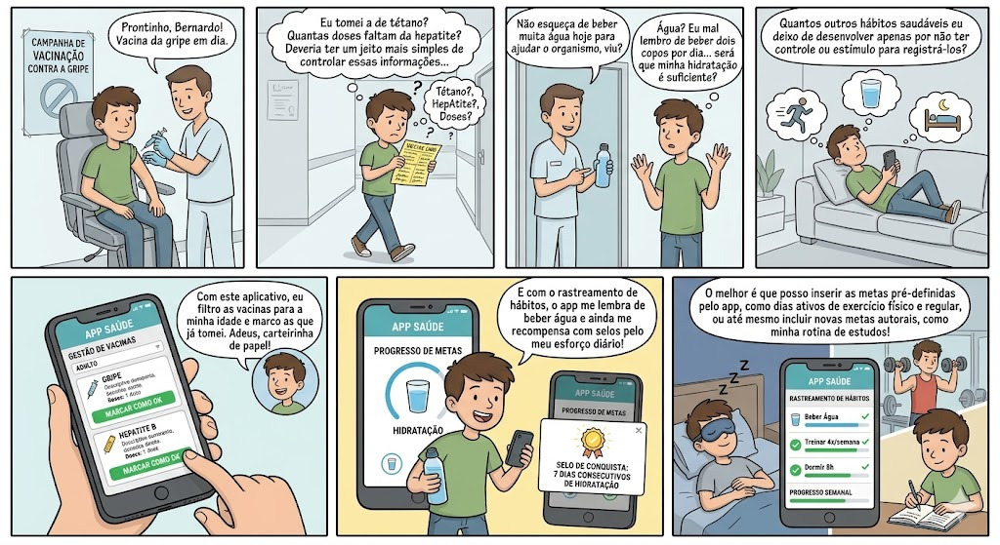

- **Cenário 1: A necessidade de organização clínica**
  Bernardo vai ao posto de saúde tomar a vacina da gripe. Ao sair, ele fica confuso, tentando lembrar de cabeça se já tomou a vacina de tétano ou quantas doses faltam para concluir o ciclo da hepatite. Ele sente a necessidade de ter essas informações de forma centralizada.
- **Cenário 2: A dificuldade na manutenção de hábitos básicos**
  O médico recomenda que Bernardo beba mais água ao longo do dia para ajudar seu organismo. Bernardo reflete sobre sua rotina e percebe que raramente lembra de beber dois copos de água. Enquanto está no sofá, ele também nota que perde facilmente o controle de outros hábitos essenciais, como horas de sono e exercícios físicos.
- **Cenário 3: Rastreamento e Gestão pelo Aplicativo**
  Bernardo começa a utilizar o "APP Saúde" (Cinco Tigres Felizes). Na tela de Gestão de Vacinas, ele filtra as recomendações para seu perfil "Adulto" e marca facilmente as doses da Gripe e Hepatite B como concluídas ("Ok"), abandonando a velha carteirinha de papel.
- **Cenário 4: Gamificação e Progressão Diária**
  Pelo celular, Bernardo recebe um lembrete do aplicativo para beber água e atualiza sua barra de progresso. Por atingir sua meta durante a semana, um _pop-up_ aparece recompensando-o com o "Selo de Conquista: 7 Dias Consecutivos de Hidratação". Motivado, ele utiliza o painel de rastreamento de hábitos para monitorar metas sugeridas pelo app (como "Treinar 4x/semana" e "Dormir 8h") e cadastra suas metas autorais, garantindo também o foco em sua "Rotina de Estudos".
